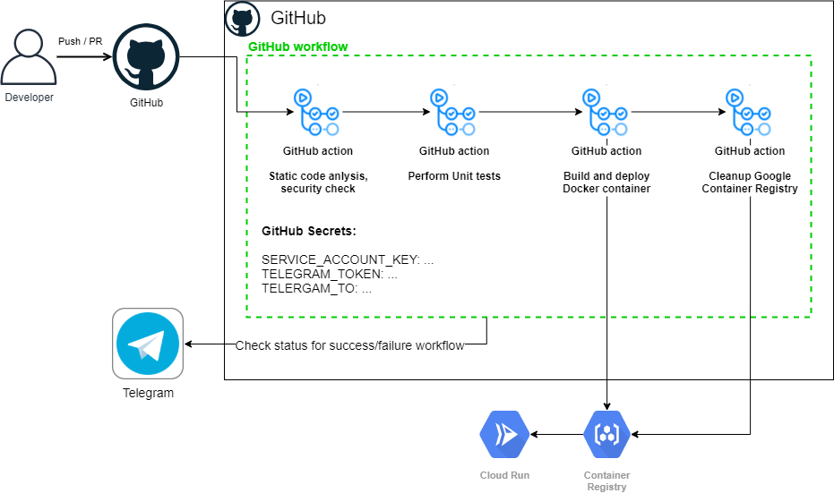

# Golang Application (app2_go)

This is Golang application repo, created for [Andersen DevOps Course May-July`2021 exam](https://github.com/mariohs22/andersen-devops-course/tree/main/exam).

## Description

This is simple `Hello world` dockerized Golang application. On every push or pull request on main branch of this repo GitHub runs action script to perform CI/CD:

- Static analysis of .go files (by [golangci-lint](https://github.com/golangci/golangci-lint));
- Golang security check (by [gosec](https://github.com/securego/gosec));
- Unit tests;
- Build docker container and deploy it to [Google Cloud Platform](https://cloud.google.com/);
- Cleanup of Google Container Registry.

**Final result** (if CI/CD job is success) is available on [https://app-go-service2-wwaf2ot3bq-uc.a.run.app](https://app-go-service2-wwaf2ot3bq-uc.a.run.app).

You will receive a telegram message if CI/CD job has succeeded or failed.

### Secret management

CI/CD job uses GitHub secrets, which you can setting up on `Settings / Secrets` section:

`SERVICE_ACCOUNT_KEY` - App name, which you can set up in Heroku dashboard (currently `mario-app12355`)
`TELEGRAM_TOKEN` - Telegram Bot token. To use notifications you need to create a Telegram bot by talking to [@BotFather](https://t.me/botfather) bot. See official guide here: [https://core.telegram.org/bots#6-botfather](https://core.telegram.org/bots#6-botfather).
`TELEGRAM_TO` - Your telegram channel (`@channelname`) or user id. You can find your user id, for example by talking to [@jsondumpbot](https://t.me/jsondumpbot)

### LOGS

You can see logs of every CI/CD job in [Actions](https://github.com/mariohs22/app2_go/actions) section of current repo. Also logs are available at Google Cloud Platform.
